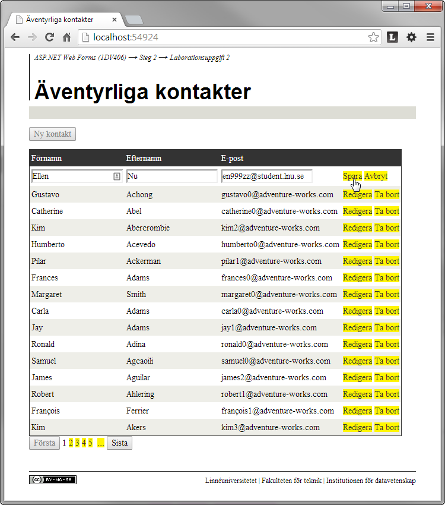

2.2 Äventyrliga kontakter
=========================
[2-2-aventyrliga-kontakter.pdf](https://github.com/1dv406/kursmaterial/raw/master/Laborationsuppgifter/2-2-aventyrliga-kontakter.pdf)

"Målet med laborationsuppgiften är att du ska skapa en webbapplikation, uppdelade i flera lager, där användaren kan ta del av och redigera innehållet i tabellen Person.Contact i databasen 1dv406_AdventureWorksAssignment.

Du kommer under laborationsuppgiften använda ADO.NET för att exekvera lagrade procedurer i databasen. Du kommer även att fördjupa dig mer i databundna kontroller, men framför allt få en insikt om vad en flerlagerapplikation är.

Du har stor frihet att utforma webbapplikationen på det sätt du önskar."

